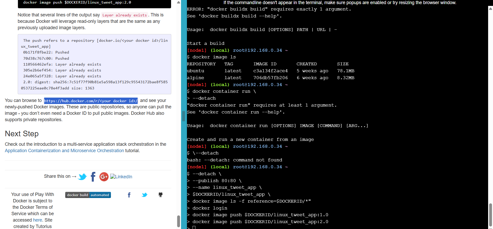
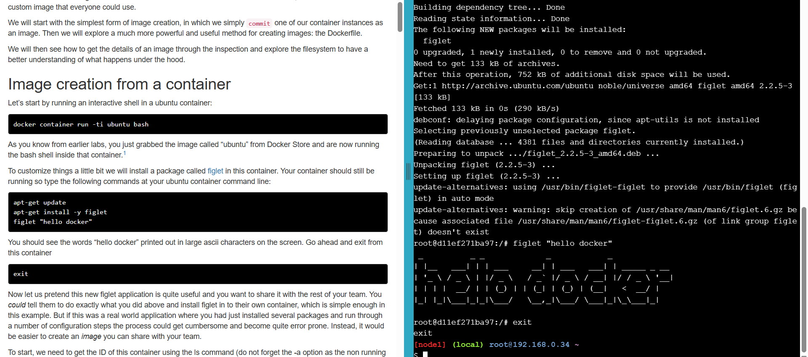
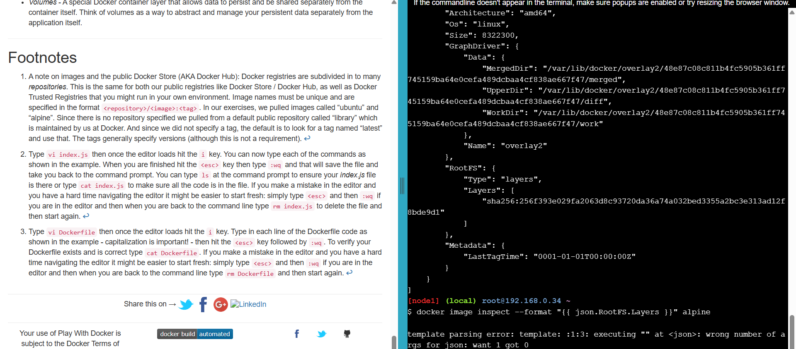
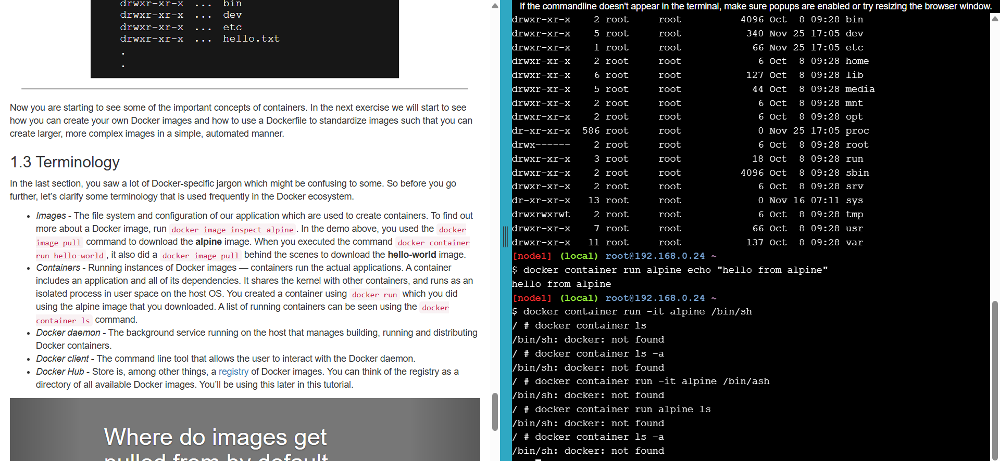
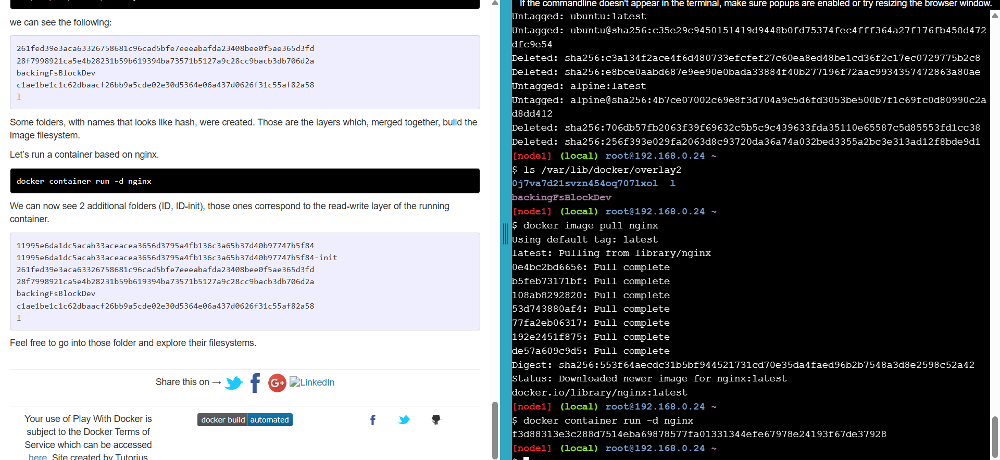

# CST323
CST323 Repository

# Activity Report: Test Application Development and Cloud Deployment

---

## 1. Cover Sheet
 #### Test Application Development and Cloud Deployment  
 #### Elijah Kremer 
 #### November 28, 2025  
 #### Cloud Computing Activity Report  
 #### CST 323

---

## 2. Screenshot of Azure Portal
*Insert screenshot here of being logged into the Azure Portal.*  

## Screenshot of Application

## Screenshot of Application Running on Azure

## Screenshot of Application Running on Azure

---

## Screenshot of Application Running on AWS

## Screenshot of Application Running on Google

---
---

## 3. Framework and Technology Chosen
The test application is being developed using the following stack:  
- **Backend Framework:** Spring Boot (Java)  
- **Frontend Framework:** Bootstrap with Angular for UI components  
- **Database:** MySQL (hosted in Azure Database for MySQL)  
- **Cloud Provider:** Microsoft Azure  
- **Version Control:** GitHub for repository management  

This combination was chosen for its scalability, modularity, and strong community support.

---

## 4. Database Progress and Status
### ER Diagram 
### Users Table

| Field     | Type      | Key |
|-----------|-----------|-----|
| user_id   | INT       | PK  |
| email     | VARCHAR   |     |
| full_name | VARCHAR   |     |
| role      | VARCHAR   |     |

### Products Tabel

| Column       | Type          | Key        |                           |
|--------------|---------------|--------------------|--------------------------------------|
| id           | BIGINT        | PK, AUTO_INCREMENT | 
| name         | VARCHAR(100)  | NOT NULL           |   |
| description  | VARCHAR(255)  | NULL allowed       | 
| price        | DECIMAL(10,2) | NOT NULL           |

--- 

### Tables Built
- **Users** (user_id, username, email, password, role)  
- **Products** (product_id, name, description, price, stock)  

 

### Tables Remaining
- **Payments** (payment_id, order_id, amount, status, payment_date)  
- **AuditLogs** (log_id, user_id, action, timestamp)  
- **OtherPages** Potential for more pages included
- **Orders** (order_id, user_id, product_id, quantity, order_date)  

---

## 5. Application Development Progress
### Pages/Services Built
- **Dashboard Page** displaying user-specific data  
- **Products Page** displays products

### Pages/Services Remaining
- **Login Page** with authentication service  
- **Payment Page** with integration to payment gateway  
- **Admin Panel** for managing users and products  
- **Audit Log Service** for tracking user actions  
- **Other**
---

## 6. Current Issues
- **Database Connection Errors:** Intermittent issues connecting Spring Boot to Azure MySQL.  
- **Deployment Pipeline:** CI/CD pipeline not fully automated; manual steps still required.  
- **UI Responsiveness:** Some Bootstrap components not rendering correctly on mobile devices.  
- **Scaling Tests:** Auto-scaling configuration in Azure App Service needs refinement.  

---

## 7. Screencast Demonstration

[Screencast Demo ](https://www.loom.com/share/0cd7abeb996846809257ae4f936c7bb7)

---
## Tutorial Screenshots Topic 6

## 8. Research Questions

- Docker is an open-source platform that enables developers to build, ship, and run applications inside containers.
- It ensures applications run consistently across different environments (development, testing, production)
- A Dockerfile is a plain text file containing instructions to build a Docker image.
- Think of it as a recipe: it specifies the base image, dependencies, configurations, and commands to run.
- A Docker image is a lightweight, standalone, executable package that includes everything needed to run an application: code, runtime, libraries, and settings.
- It’s the blueprint created from a Dockerfile.
- A Docker container is a running instance of a Docker image.
- Containers are isolated environments that can be started, stopped, moved, and deleted independently.
- Docker Hub is Docker’s official cloud-based registry where developers can store, share, and distribute Docker images.
- It hosts both official images (like Ubuntu, MySQL) and community-contributed ones.
 Five Advantages of Using Docker Containers
- Portability – Run the same container on any system with Docker installed.
- Consistency – Eliminates “works on my machine” issues by standardizing environments.
- Efficiency – Containers are lightweight compared to virtual machines, using fewer resources.
- Scalability – Easy to scale applications horizontally by running multiple containers.
- Isolation – Each container runs independently, reducing conflicts between applications.

| Command                        | Purpose                                                                 |
|--------------------------------|-------------------------------------------------------------------------|
| `docker build -t myapp .`      | Builds a Docker image from a Dockerfile in the current directory.       |
| `docker run -d -p 8080:80 myapp` | Runs a container in detached mode, mapping host port 8080 to container port 80. |
| `docker ps`                    | Lists all running containers.                                           |
| `docker stop <container_id>`   | Stops a running container.                                              |
| `docker pull ubuntu`           | Downloads an image (e.g., Ubuntu) from Docker Hub.                      |

### Part 2
- Kubernetes is an open-source container orchestration platform that automates deployment, scaling, and management of containerized applications.
- It ensures applications run reliably across clusters of machines, handling load balancing, scaling, and self-healing.

10 Key Learnings: Pods are ephemeral, ReplicaSets enforce state, Deployments manage updates, Labels organize, Services expose pods, ConfigMaps/Secrets store config, Namespaces isolate, Autoscaling adjusts pods, Control plane manages nodes, kubectl supports declarative/imperative ops.

Why Use Kubernetes
- Manages complex apps at scale, ensures HA, fault tolerance, and portability.
5 Features: Self-healing, autoscaling, load balancing, rolling updates, service discovery.

# AES Case Study: Service Level Agreements

Acme eAuctions (AEA) introduced service level agreements (SLAs) when moving from a closed auction site to a new PaaS model. SLAs were tailored to each system component based on criticality:

- **Seller Services**: 99.9% uptime, 1-day recovery  
- **Buyer Services**: 99.9% uptime, 15-minute recovery  
- **API Layer**: 99.9% uptime, ≤1 second performance, 15-minute recovery  
- **App Store**: 99% uptime, 7-day recovery  
- **Privacy Policy**: Published  

The rationale was that buyer services are most critical for auction execution, so they received the strictest SLA. The API layer aligns with buyer services but adds a performance guarantee. Seller services are important but less critical, while the App Store is non-mission-critical and therefore has a lower SLA.

Terms and conditions are published online, with consumers agreeing at sign-up and partners required to sign agreements. Large customers may negotiate stricter SLAs. Payment compliance (PCI DSS) is excluded since third parties handle transactions, though audits such as SSAE 16 or SOC2 may be added if demanded.  

Three Elements in a Dockerfile
- FROM
- Description: Specifies the base image to build upon (e.g., FROM ubuntu:20.04).
- Use: Defines the starting environment, such as an operating system or runtime.
- COPY / ADD
- Description: Copies files from the local machine into the image.
- Use: Brings application code, configuration files, or dependencies into the container.
- CMD / ENTRYPOINT
- Description: Defines the default command or process that runs when the container starts.

A Dockerfile defines how to build and run containers using elements like FROM, COPY, and CMD. In cloud systems, HA ensures uptime, failover provides resilience, and the number of nines quantifies reliability goals. Together, they guide infrastructure design to minimize downtime and guarantee service continuity.

---
