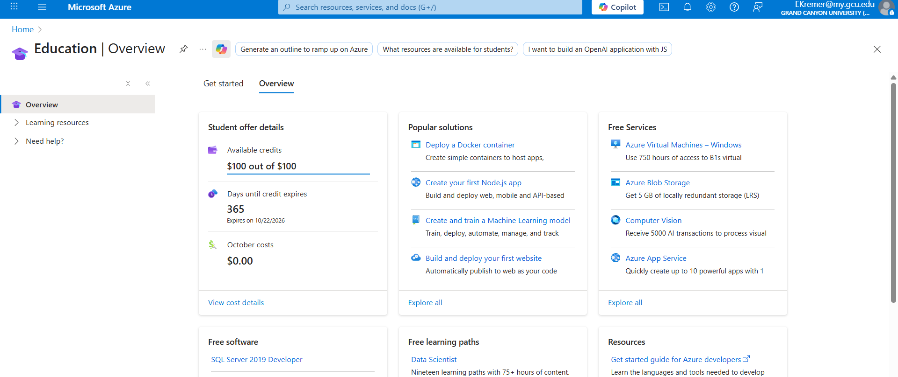
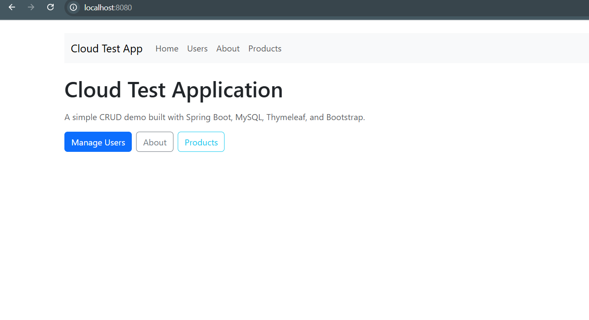
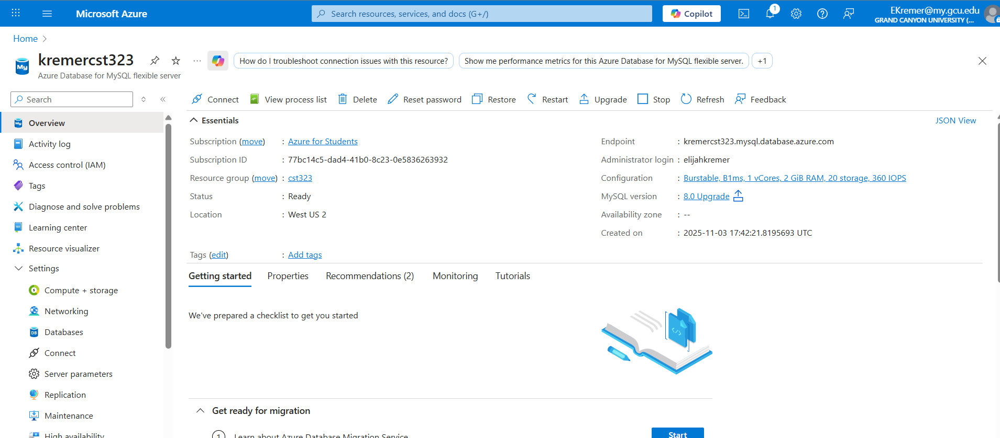
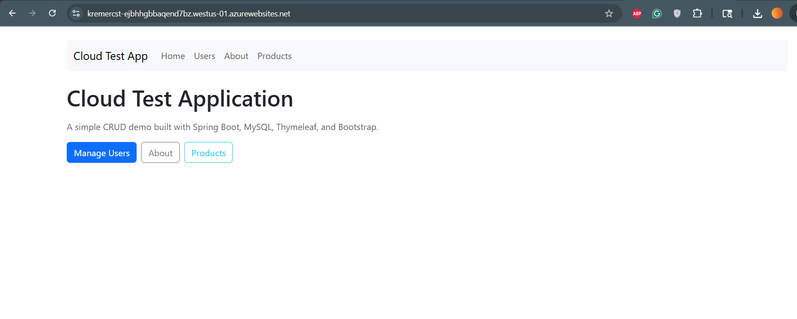
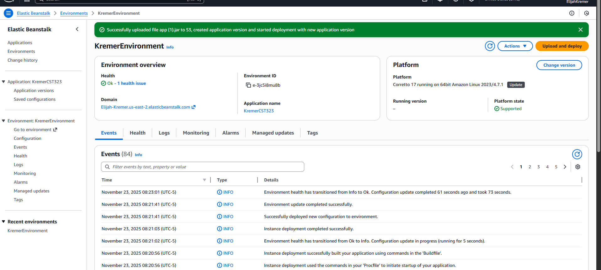
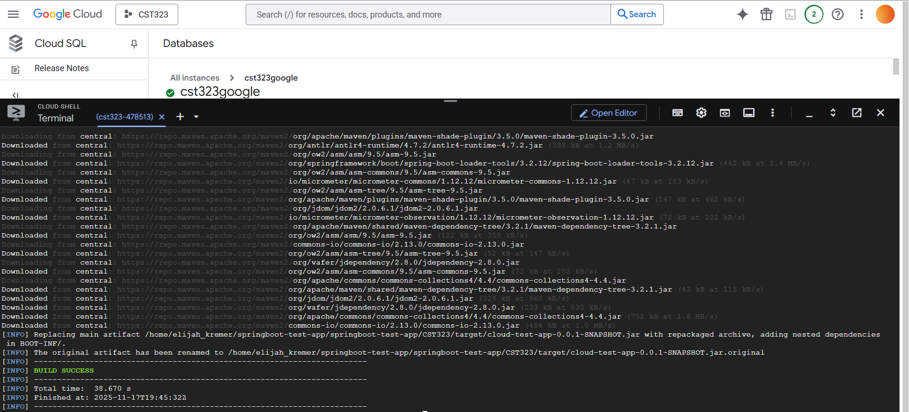

# CST323
CST323 Repository

# Activity Report: Test Application Development and Cloud Deployment

---

## 1. Cover Sheet
 #### Test Application Development and Cloud Deployment  
 #### Elijah Kremer 
 #### November 23, 2025  
 #### Cloud Computing Activity Report  
 #### CST 323

---

## 2. Screenshot of Azure Portal
*Insert screenshot here of being logged into the Azure Portal.*  

## Screenshot of Application

## Screenshot of Application Running on Azure

## Screenshot of Application Running on Azure

---

## Screenshot of Application Running on AWS

## Screenshot of Application Running on Google

---
---

## 3. Framework and Technology Chosen
The test application is being developed using the following stack:  
- **Backend Framework:** Spring Boot (Java)  
- **Frontend Framework:** Bootstrap with Angular for UI components  
- **Database:** MySQL (hosted in Azure Database for MySQL)  
- **Cloud Provider:** Microsoft Azure  
- **Version Control:** GitHub for repository management  

This combination was chosen for its scalability, modularity, and strong community support.

---

## 4. Database Progress and Status
### ER Diagram 
### Users Table

| Field     | Type      | Key |
|-----------|-----------|-----|
| user_id   | INT       | PK  |
| email     | VARCHAR   |     |
| full_name | VARCHAR   |     |
| role      | VARCHAR   |     |

### Products Tabel

| Column       | Type          | Key        |                           |
|--------------|---------------|--------------------|--------------------------------------|
| id           | BIGINT        | PK, AUTO_INCREMENT | 
| name         | VARCHAR(100)  | NOT NULL           |   |
| description  | VARCHAR(255)  | NULL allowed       | 
| price        | DECIMAL(10,2) | NOT NULL           |

--- 

### Tables Built
- **Users** (user_id, username, email, password, role)  
- **Products** (product_id, name, description, price, stock)  

 

### Tables Remaining
- **Payments** (payment_id, order_id, amount, status, payment_date)  
- **AuditLogs** (log_id, user_id, action, timestamp)  
- **OtherPages** Potential for more pages included
- **Orders** (order_id, user_id, product_id, quantity, order_date)  

---

## 5. Application Development Progress
### Pages/Services Built
- **Dashboard Page** displaying user-specific data  
- **Products Page** displays products

### Pages/Services Remaining
- **Login Page** with authentication service  
- **Payment Page** with integration to payment gateway  
- **Admin Panel** for managing users and products  
- **Audit Log Service** for tracking user actions  
- **Other**
---

## 6. Current Issues
- **Database Connection Errors:** Intermittent issues connecting Spring Boot to Azure MySQL.  
- **Deployment Pipeline:** CI/CD pipeline not fully automated; manual steps still required.  
- **UI Responsiveness:** Some Bootstrap components not rendering correctly on mobile devices.  
- **Scaling Tests:** Auto-scaling configuration in Azure App Service needs refinement.  

---

## 7. Screencast Demonstration

[Screencast Demo ](https://www.loom.com/share/0cd7abeb996846809257ae4f936c7bb7)

---

## 8. Research Questions

a. REST API Security and Non-Functional Questions
When consuming a REST API from a social media site, one key question is about authentication and authorization—what methods (OAuth, API keys) are required and how secure are they. Another question is about rate limits and throttling, since exceeding limits could disrupt application performance. You should also ask about data encryption, both in transit (HTTPS/TLS) and at rest, to ensure sensitive information is protected. A fourth question involves availability and uptime guarantees, since downtime could affect your app’s reliability. Finally, it’s important to ask about logging and monitoring policies, including how security incidents are reported and handled by the vendor.

b. AWS vs Google Cloud Features
Amazon AWS and Google Cloud both offer compute services (EC2 vs Compute Engine), but Google emphasizes containerization with Kubernetes. For storage, AWS S3 and Google Cloud Storage are similar, though Google often has simpler pricing. In databases, AWS provides RDS and DynamoDB, while Google offers Cloud SQL and BigQuery, with BigQuery excelling in analytics. Both have networking services with VPCs, but Google’s global fiber network is known for speed. For serverless computing, AWS Lambda and Google Cloud Functions are comparable, though Google integrates tightly with Cloud Run. In AI/ML, AWS has SageMaker, while Google leads with Vertex AI and its research background. Both platforms emphasize security, but AWS has broader compliance certifications. For hybrid cloud, AWS Outposts competes with Google Anthos, with Anthos being more multi-cloud friendly. Pricing differs: AWS offers flexible reserved/spot pricing, while Google provides sustained-use discounts. Finally, in ease of use, AWS is powerful but complex, while Google Cloud is simpler and beginner-friendly.

c. Limitations for Cloud Deployment
One limitation is legacy system compatibility—older applications may rely on proprietary software that doesn’t run well in cloud environments. Another is regulatory compliance, where strict data residency laws may prevent storing data in certain cloud regions. A third limitation is performance requirements, since applications needing ultra-low latency may struggle in distributed cloud setups. Cost can also be a barrier, as unexpected expenses from bandwidth, storage, or compute usage may exceed budgets. Finally, vendor lock-in is a business limitation, since relying heavily on one provider’s proprietary services can make future migrations or multi-cloud strategies difficult

---
