# CST323
CST323 Repository

# Activity Report: Test Application Development and Cloud Deployment

---

## 1. Cover Sheet
 #### Test Application Development and Cloud Deployment  
 #### Elijah Kremer 
 #### Dec 4, 2025  
 #### Cloud Computing Activity Report  
 #### CST 323

---

## 2. Screenshot of Azure Portal
*Insert screenshot here of being logged into the Azure Portal.*  

## Screenshot of Application

## Screenshot of Application Running on Azure

## Screenshot of Application Running on Azure

---

## Screenshot of Application Running on AWS

## Screenshot of Application Running on Google

---
---

## 3. Framework and Technology Chosen
The test application is being developed using the following stack:  
- **Backend Framework:** Spring Boot (Java)  
- **Frontend Framework:** Bootstrap with Angular for UI components  
- **Database:** MySQL (hosted in Azure Database for MySQL)  
- **Cloud Provider:** Microsoft Azure  
- **Version Control:** GitHub for repository management  

This combination was chosen for its scalability, modularity, and strong community support.

---

## 4. Database Progress and Status
### ER Diagram 
### Users Table

| Field     | Type      | Key |
|-----------|-----------|-----|
| user_id   | INT       | PK  |
| email     | VARCHAR   |     |
| full_name | VARCHAR   |     |
| role      | VARCHAR   |     |

### Products Tabel

| Column       | Type          | Key        |                           |
|--------------|---------------|--------------------|--------------------------------------|
| id           | BIGINT        | PK, AUTO_INCREMENT | 
| name         | VARCHAR(100)  | NOT NULL           |   |
| description  | VARCHAR(255)  | NULL allowed       | 
| price        | DECIMAL(10,2) | NOT NULL           |

--- 

### Tables Built
- **Users** (user_id, username, email, password, role)  
- **Products** (product_id, name, description, price, stock)  

 

### Tables Remaining
- **Payments** (payment_id, order_id, amount, status, payment_date)  
- **AuditLogs** (log_id, user_id, action, timestamp)  
- **OtherPages** Potential for more pages included
- **Orders** (order_id, user_id, product_id, quantity, order_date)  

---

## 5. Application Development Progress
### Pages/Services Built
- **Dashboard Page** displaying user-specific data  
- **Products Page** displays products

### Pages/Services Remaining
- **Login Page** with authentication service  
- **Payment Page** with integration to payment gateway  
- **Admin Panel** for managing users and products  
- **Audit Log Service** for tracking user actions  
- **Other**
---

## 6. Current Issues
- **Database Connection Errors:** Intermittent issues connecting Spring Boot to Azure MySQL.  
- **Deployment Pipeline:** CI/CD pipeline not fully automated; manual steps still required.  
- **UI Responsiveness:** Some Bootstrap components not rendering correctly on mobile devices.  
- **Scaling Tests:** Auto-scaling configuration in Azure App Service needs refinement.  

---

## 7. Screencast Demonstration

[Screencast Demo ](https://www.loom.com/share/e41af9b9ccd343139a3d78e573e29bbd)

---
## Tutorial Screenshots 

## Activity 6 Logging Proccess

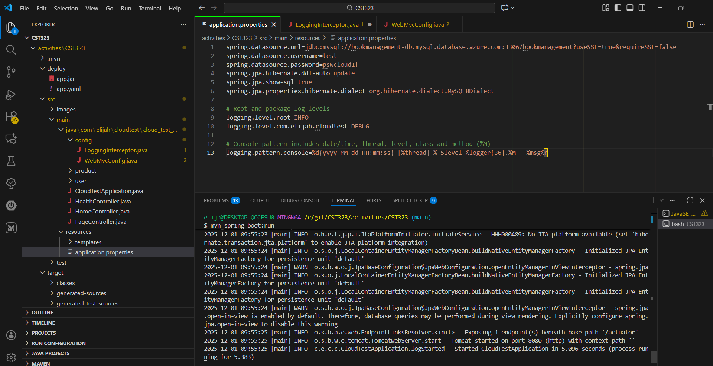

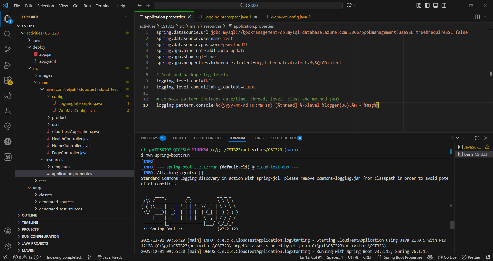

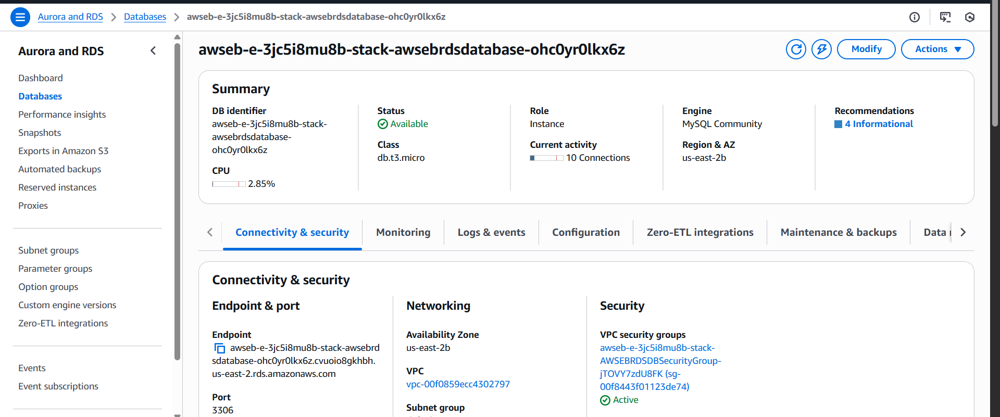

### Downloaded Logs 
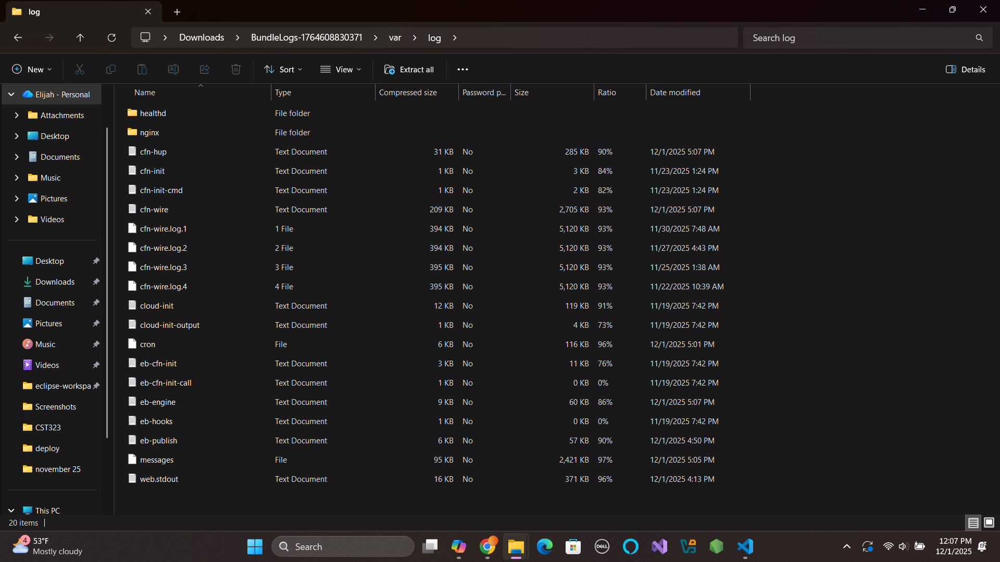

### Loggly 
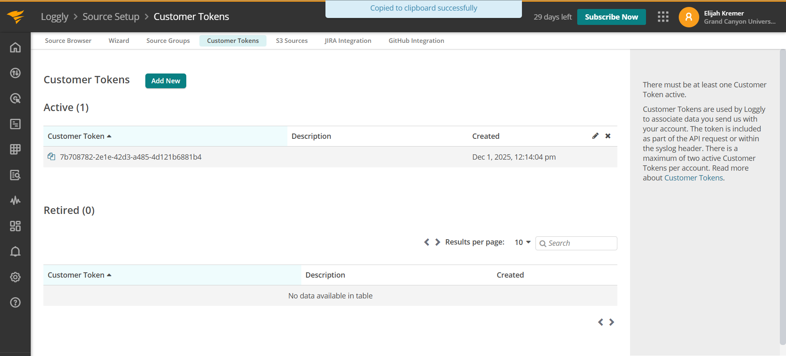

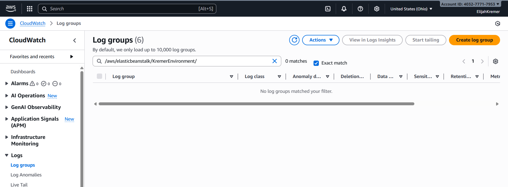

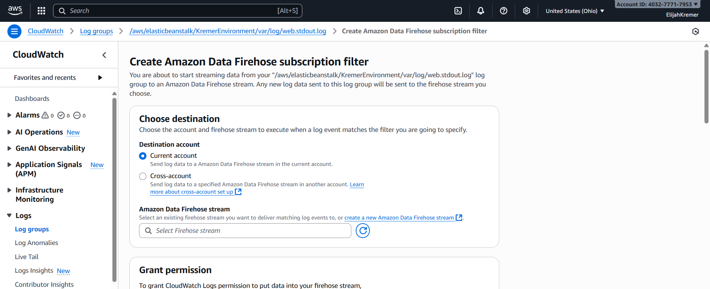

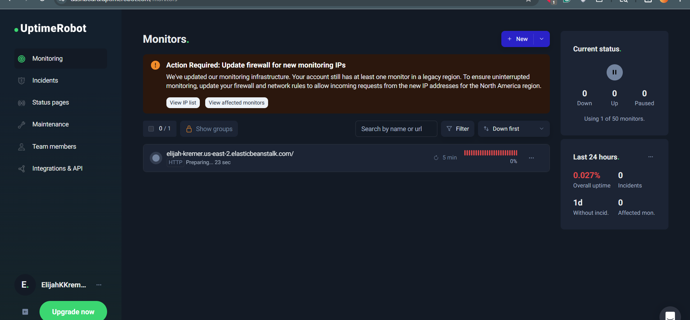

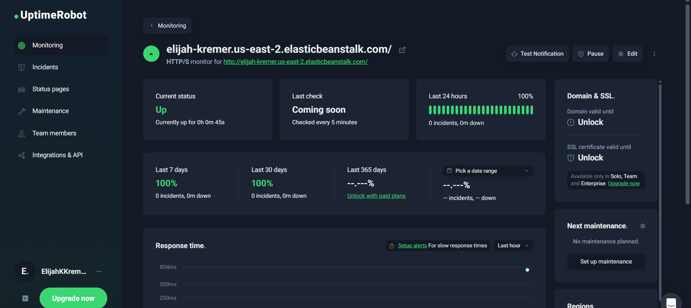

### CodeBuild
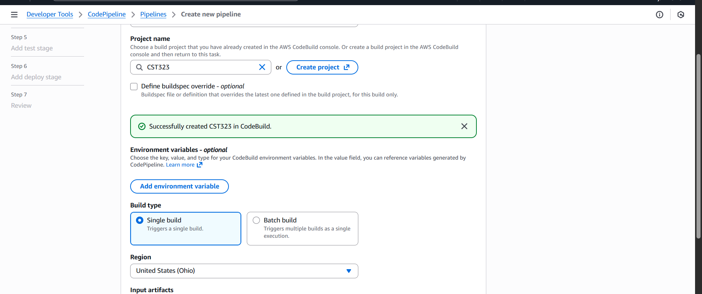

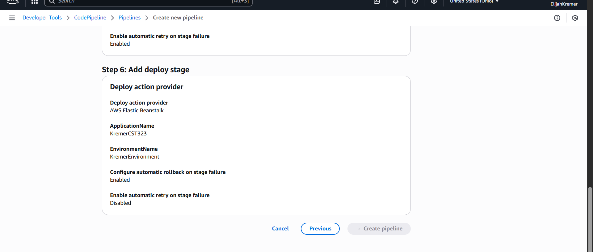

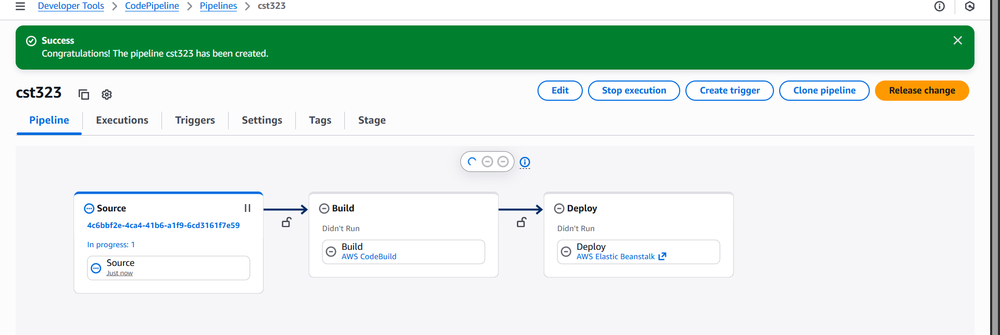

## 8. Research Questions
Why is adding robust logging important for an application deployed to the cloud?
- Debugging in distributed systems: Cloud environments often involve multiple instances, load balancers, and microservices. Robust logging helps trace issues across these components.
- Monitoring and observability: Logs provide visibility into application health, performance bottlenecks, and user activity.
- Compliance and auditing: Many industries require detailed logs for security audits, regulatory compliance, and incident response.
- Scalability and resilience: With autoscaling and ephemeral instances, logs are often the only way to understand what happened when a container or VM disappears.

Three features of the logging framework not implemented but important for production-level applications
- Structured JSON logging
- Instead of plain text, logs should be in JSON format for easier parsing and integration with log aggregation tools.
- Centralized log aggregation
- Collect logs from all instances into a single system (e.g., CloudWatch, ELK stack) to avoid losing logs when instances terminate.
- Asynchronous/non-blocking logging
- Prevents logging from slowing down application performance by writing logs in a separate thread or queue.

Two enterprise-class logging products besides Loggly
- Splunk → Provides advanced log analytics, dashboards, anomaly detection, and machine learning insights.
- Datadog → Offers centralized logging, monitoring, and alerting with strong integrations for cloud-native environments.

Purpose of setting up a log file alert
- Detect anomalies early: Alerts notify you when specific error patterns or thresholds appear in logs (e.g., repeated NullPointerException).
- Security monitoring: Alerts can flag suspicious activity (e.g., failed login attempts).
- Operational visibility: Ensures teams are aware of critical issues without manually checking logs.
- Compliance: Helps meet audit requirements by proving proactive monitoring of system events.

Purpose of setting up an application availability alert
- Immediate awareness of downtime: Alerts notify you when the app becomes unreachable, so you can respond quickly.
- Customer experience protection: Minimizes the time users are impacted by outages.
- SLA compliance: Ensures uptime guarantees are met for enterprise contracts.
- Root cause correlation: Availability alerts combined with log alerts help pinpoint whether issues are code, infrastructure, or network related.

What Roles Does Maven Play in CI/CD?
- Dependency Management → automatically downloads required libraries.
- Build Automation → compiles Java code, runs tests, packages into JAR/WAR.
- Consistency → ensures builds are reproducible across environments.
- Integration with CI/CD tools → Maven commands (mvn clean package) are easily scripted in buildspec files or Jenkins pipelines.
- Artifact Management → produces deployable artifacts that can be passed to deployment stages.

What Role Does a Source Control System Play in CI/CD?
- Version Control → tracks changes to code, enabling rollback and history.
- Collaboration → multiple developers can work on branches and merge changes.
- Triggering Builds → commits/pushes trigger CI/CD pipelines automatically.
- Auditability → every change is logged with author, timestamp, and commit message.
- Integration → GitHub/CodeCommit connects directly to CodePipeline as the source stage.

What Role Does a Source Control System Play in CI/CD?
- Version Control → tracks changes to code, enabling rollback and history.
- Collaboration → multiple developers can work on branches and merge changes.
- Triggering Builds → commits/pushes trigger CI/CD pipelines automatically.
- Auditability → every change is logged with author, timestamp, and commit message.
- Integration → GitHub/CodeCommit connects directly to CodePipeline as the source stage.

What Role Does a Source Control System Play in CI/CD?
- Version Control → tracks changes to code, enabling rollback and history.
- Collaboration → multiple developers can work on branches and merge changes.
- Triggering Builds → commits/pushes trigger CI/CD pipelines automatically.
- Auditability → every change is logged with author, timestamp, and commit message.
- Integration → GitHub/CodeCommit connects directly to CodePipeline as the source stage.

How Did Your Chosen Build Pipeline Tool Support CI/CD?
Using AWS CodePipeline:
- Orchestration → connects Source (GitHub), Build (CodeBuild), and Deploy (Elastic Beanstalk).
- Automation → runs automatically on every commit.
- Scalability → integrates with AWS services (EB, ECS, CloudFormation).
- Reliability → retries failed stages, logs errors in CloudWatch.
- Artifact Handling → passes JARs from build stage to deploy stage seamlessly.

Besides Build and Deployment, Three Other Features for Robust CI/CD
- Automated Testing → unit, integration, or regression tests run before deployment.
- Static Code Analysis → tools like SonarQube or Checkstyle to enforce code quality.
- Security Scanning → scan dependencies for vulnerabilities (e.g., OWASP Dependency Check).
- Notifications (bonus) → integrate with Slack/Teams to alert developers of pipeline status.
- Infrastructure as Code (bonus) → integrate Terraform/CloudFormation to provision environments alongside app deployment.

Splunk for DevOps
Splunk is an enterprise-class logging, analytics, and observability platform that ingests machine data from applications, servers, and infrastructure. DevOps engineers use it to:
- Centralize logs, metrics, and traces for full-stack visibility.
- Real-time monitoring → detect anomalies before they impact users.
- Dashboards and alerts → visualize performance trends and set proactive thresholds.
- Root cause analysis → quickly trace issues across distributed systems.
- Predictive analytics → machine learning models forecast potential failures.

Logging Best Practices in Cloud Applications
Relevant log data includes:
- Timestamps (UTC format for consistency).
- Severity levels (INFO, WARN, ERROR).
- Contextual metadata (user ID, request ID, service name).
- Event details (operation performed, outcome, error codes).
Three best practices:
- Standardize log formats → ensure consistency across services.
- Secure logs → avoid sensitive data exposure, encrypt at rest.
- Make logs actionable → include enough context for debugging without noise.
Three risks of inadequate logging:
- Delayed troubleshooting → engineers can’t trace root causes quickly.
- Compliance failures → missing audit trails for regulations like HIPAA or GDPR.
- Blind spots in monitoring → undetected performance or security issues.

CI/CD Pipeline Tools
Three widely used tools:
- Jenkins → Open-source automation server; supports plugins for builds, tests, and deployments.
- GitLab CI/CD → Integrated into GitLab; provides pipelines, runners, and built-in DevOps lifecycle management.
- GitHub Actions → Native to GitHub; uses YAML workflows to automate builds, tests, and deployments directly from repositories.

Five Capabilities Defining DevOps
- Continuous Integration (CI) → frequent code merges with automated builds/tests.
- Continuous Delivery (CD) → automated deployment pipelines ensure rapid release cycles.
- Automation → infrastructure provisioning, testing, and deployment reduce manual errors.
- Monitoring & Feedback → observability tools provide real-time insights for improvement.
- Collaboration & Culture → breaking silos between dev and ops improves agility and reliability.
