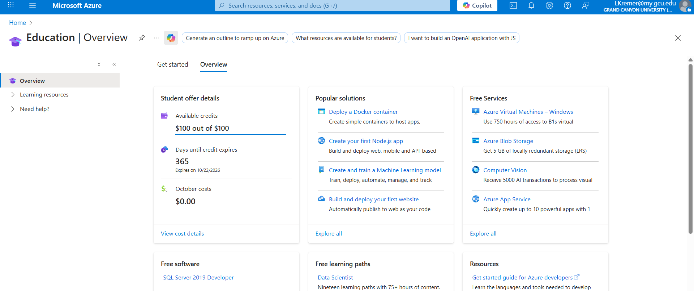
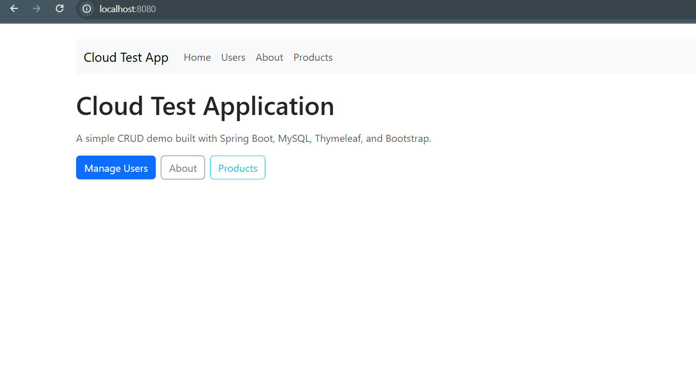
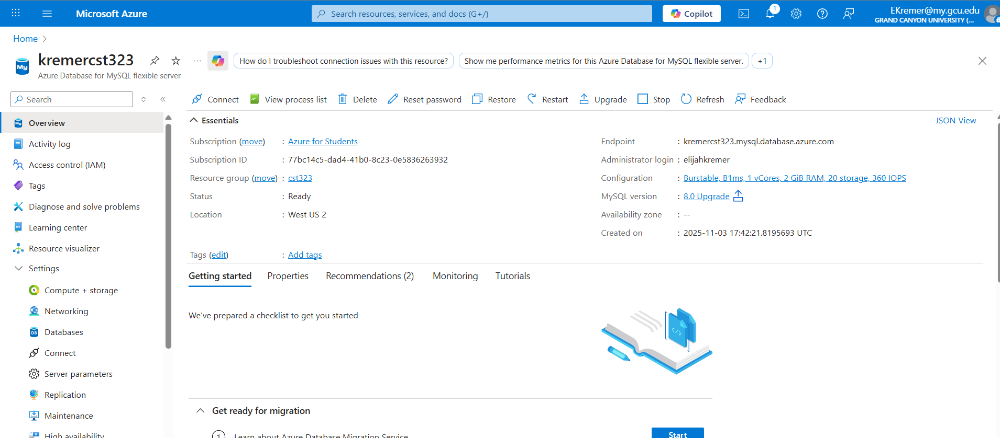
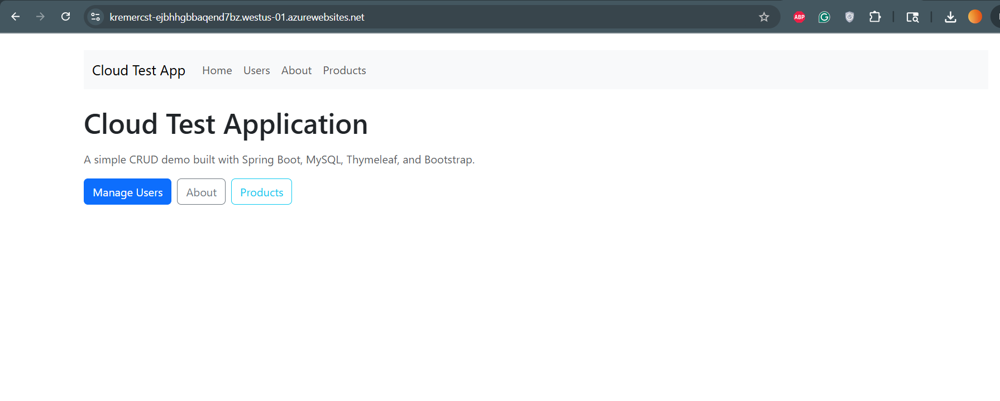

# CST323
CST323 Repository

# Activity Report: Test Application Development and Cloud Deployment

---

## 1. Cover Sheet
 #### Test Application Development and Cloud Deployment  
 #### Elijah Kremer 
 #### November 8, 2025  
 #### Cloud Computing Activity Report  
 #### CST 323

---

## 2. Screenshot of Azure Portal
*Insert screenshot here of being logged into the Azure Portal.*  

## Screenshot of Application

## Screenshot of Application Running on Azure

## Screenshot of Application Running on Azure

---

## 3. Framework and Technology Chosen
The test application is being developed using the following stack:  
- **Backend Framework:** Spring Boot (Java)  
- **Frontend Framework:** Bootstrap with Angular for UI components  
- **Database:** MySQL (hosted in Azure Database for MySQL)  
- **Cloud Provider:** Microsoft Azure  
- **Version Control:** GitHub for repository management  

This combination was chosen for its scalability, modularity, and strong community support.

---

## 4. Database Progress and Status
### ER Diagram 
### Users Table

| Field     | Type      | Key |
|-----------|-----------|-----|
| user_id   | INT       | PK  |
| email     | VARCHAR   |     |
| full_name | VARCHAR   |     |
| role      | VARCHAR   |     |

### Products Tabel

| Column       | Type          | Key        |                           |
|--------------|---------------|--------------------|--------------------------------------|
| id           | BIGINT        | PK, AUTO_INCREMENT | 
| name         | VARCHAR(100)  | NOT NULL           |   |
| description  | VARCHAR(255)  | NULL allowed       | 
| price        | DECIMAL(10,2) | NOT NULL           |

--- 

### Tables Built
- **Users** (user_id, username, email, password, role)  
- **Products** (product_id, name, description, price, stock)  

 

### Tables Remaining
- **Payments** (payment_id, order_id, amount, status, payment_date)  
- **AuditLogs** (log_id, user_id, action, timestamp)  
- **OtherPages** Potential for more pages included
- **Orders** (order_id, user_id, product_id, quantity, order_date)  

---

## 5. Application Development Progress
### Pages/Services Built
- **Dashboard Page** displaying user-specific data  
- **Products Page** displays products

### Pages/Services Remaining
- **Login Page** with authentication service  
- **Payment Page** with integration to payment gateway  
- **Admin Panel** for managing users and products  
- **Audit Log Service** for tracking user actions  
- **Other**
---

## 6. Current Issues
- **Database Connection Errors:** Intermittent issues connecting Spring Boot to Azure MySQL.  
- **Deployment Pipeline:** CI/CD pipeline not fully automated; manual steps still required.  
- **UI Responsiveness:** Some Bootstrap components not rendering correctly on mobile devices.  
- **Scaling Tests:** Auto-scaling configuration in Azure App Service needs refinement.  

---

## 7. Screencast Demonstration

[Screencast Demo ](https://www.loom.com/share/347601a867e94d79b8df0ff4aeda7820)

---

## 8. Research Questions

 Cloud Deployment Models
The public cloud model is hosted by third‑party providers and shared across many users. Its advantages are low upfront cost, easy scalability, and broad accessibility. Its disadvantages are less control over security, possible compliance issues, and reliance on internet connectivity. The private cloud model is dedicated to a single organization. Its advantages are stronger security, more customization, and better compliance control. Its disadvantages are high cost, complex management, and limited scalability compared to public options. The hybrid cloud model combines both, allowing sensitive workloads to stay private while leveraging public resources for flexibility. Its advantages are balanced cost, flexible scaling, and better disaster recovery. Its disadvantages are integration complexity, potential data transfer costs, and the need for skilled management. The rationale is that each model trades off cost, control, and flexibility, so organizations choose based on their priorities.

SaaS Applications
Two common SaaS applications are Microsoft 365 and Salesforce. Compared to building and hosting them yourself, advantages include reduced infrastructure costs, automatic updates and maintenance, and easy access from anywhere. Disadvantages include less customization, dependence on the vendor’s uptime and policies, and ongoing subscription costs that may add up over time. The rationale is that SaaS shifts responsibility for hosting and maintenance to the provider, which is efficient for most organizations, but it limits control and can create long‑term dependency.

PaaS vs. IaaS for Developers
From a developer’s perspective, PaaS (Platform as a Service) provides a ready‑made environment with frameworks, runtime, and tools, while IaaS (Infrastructure as a Service) provides raw virtual machines and storage. Three primary differences are: (1) PaaS abstracts away server management, while IaaS requires you to configure and maintain the OS and middleware; (2) PaaS accelerates development with built‑in services like databases and deployment pipelines, while IaaS gives more flexibility but requires more setup; and (3) PaaS limits customization of the underlying stack, while IaaS allows full control over the environment. The rationale is that PaaS is ideal for rapid development and consistency, while IaaS is better when you need maximum control or have specialized requirements.

---
